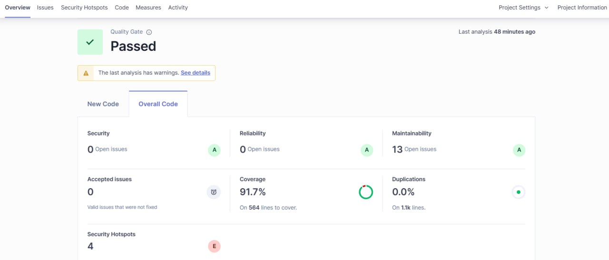
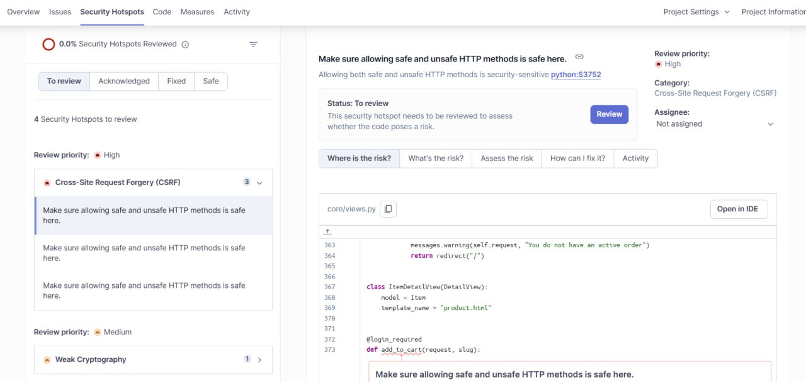
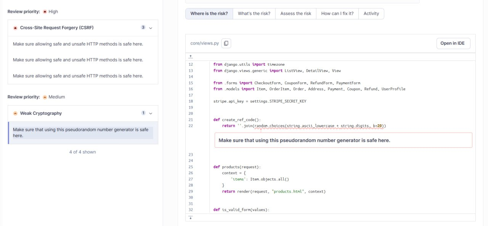

# Test Summary Report

<!-- The report should include:

A summary of testing activities performed.

Statistics on test execution (e.g., total tests, passed, failed, blocked).

A summary of defects found, categorized by severity/priority.

An assessment of the software's quality based on the test results.

A critical reflection on the limitations or gaps encountered compared to the initial Test Plan, with a justification for any deviations.
-->

## Summary of Test

### Robot Framework

Robot framework tests worked as the starting point for black box testing activities.

One of the main areas our Robot Framework tests focused on was the order-related functionalities. We tried to exhaustively explore all possibilities regarding the order interface.
These included confirming that the page appropriately displays an empty cart, verifying that products can be successfully added to and removed from the cart, testing the increase or decrease of product quantities in the cart, and validating both successful and unsuccessful removal of an order from the product page.
All of these tests were successfull.

Besides ordering, robot tests were created revolving around logging in and out and creating a user. With these tests, both happy and negative paths were considered.

| Test Case                             | Description                                                           | Expected Result                                      |
| ------------------------------------- | --------------------------------------------------------------------- | ---------------------------------------------------- |
| **Login Works**  | Basic log in sequence, with premade user details.                   | User is logged in successfully.  |
| **Check Empty Cart**                  | Verifies empty cart message appears when no products are in the cart. | Displays “Your cart is empty”.                       |
| **Add a product Order**               | Adds a product product to the cart.                                   | product is shown in cart and confirmation displayed. |
| **Increase product Quantity In Cart** | Increments product quantity by one.                                   | Quantity increases.                                  |
| **Decrease product Quantity In Cart** | Decrements product quantity by one.                                   | Quantity decreases.                                  |
| **Remove Order**                      | Removes an product from the cart.                                     | product is removed and cart becomes empty.           |
| **Unsuccessful Order Removal**        | Attempts to remove a non-existent product via product page.           | Displays “This product was not in your cart.”        |
| **Successful product Order Removal**  | Removes an existing cart product via product page.                    | Displays “This product was removed from your cart.”  |
| **Test cart persists after reopening Browser**  | Tests that after adding item to cart, closing browser and reopening and logging in, the item is still in cart.                    | Item persists in cart after reopening browser.  |
| **Test cart persists after logout and login**  | Tests that after adding item to cart, logging out and logging back in, the item is still in cart.                    | Item persists in cart after log out -> log back in.  |
| **Signup With Valid Credentials**  | Sign up test, username created when test is run                    | Simply tests signing up works as expected.  |
| **Signup With Existing Username**  | Test that existing username is not allowed                    | Can't create another account with existing username.  |
| **Signup With Weak Password**  | Test that weak pw is not allowed                    | The site has minimum 6 characters for password, so this tests under 6 characters is not allowed.  |
| **Login With Wrong Username**  | Test that nonexisting user is not allowed                    | Simply tests that wrong username leads to nowhere.  |
| **Login With Wrong Password**  | Test that wrong pw is not allowed                    | Related to the previous one, tests that correct username but incorrect pw leads to nowhere.  |
| **Login With Empty Fields**  | Test that empty fields dont work.                    | Leaving input fields empty should result in error. (doesn't)  |

An important note discovered from Robot tests was that when logging in with empty fields there is no error message (or anything, nothing happens). This resulted in creating a test ensuring clicking log in doesn't lead to logged in page. It would be better to ensure an error message appears, but as that's not implemented, we had to instead go with this workaround.

### Exploratory Testing and other black box testing

By starting with robot framework tests, it was seamless to continue to black box testing. As for robot framework, one usually first goes through the automated sequences manually, to discover correct element locators and understand the user flow. Thus, robot framework and manual testing complement each other.

As the functionality of the web page is somewhat limited, the scope of manual testing reflects that. Exploratory testing works well, as with the expertise of the tester one can find the most important flows. Process was started with looking at items, and adding them into the cart. As the page only has one item and the categories or search don't work, it's natural then to look at adding that one item to cart.

After clicking on the item (a shirt), an overview page opens. All of the pages are not finished or polished, and there is no point focusing on appearance related issues but rather on functionality. First functionality related issue can be discovered in item overview page. After clicking on remove from cart, user is forwarded to login page. Instead there should be an error message stating there is nothing on the cart. This is small issue, because such message does appear if logged in though. Another noteworthy thing is add to cart button, which also leads to login page. It might be better to first add items to cart and only when user wants to proceed to checkout, are they asked to log in. This is for better freedom and so user doesn't get scared from login requirement before they even see the cart. Additionally, there is no button for adding more than one item to cart in the item overview page. There is one in cart, but again, for more freedom and flexibility, there could be one in the overview page as well.

In the cart page, there is option to add item or decrease item by one. There should also be an option for typing the amount, in case the user wants to order more than 2 items. If they need to click + icon multiple times, it's inconvinient and offputting. Otherwise, the cart page looks and works fine for its purpose.

For the Checkout form, there are not many notable issues either, because it is quite unfinished (Continue to checkout doesn't work for example). There is one clear issue though, as the price shows only the discounted price and doesn't inform the user it's indeed discounted. It gives an impression the price is normal price with no discount. Instead, there should be original price, discount amount and discounted price all visible to the user, for usability and transparency reasons. In the checkout form, there is validation for choosing a payment option and to fill out shipping and billing address (required fields). It's missing similar validation for country as well as Zip code. In some forms for Zip code, the form checks if it's a valid Zip in the chosen country. This advanced validation could be applied here, but there should at least have validation to require to fill the field. 

### Whitebox testing

Using Django Test framework we thoroughly test Models and Views, aiming to archeve high statement and branch coverage for simple and low-risk functions and MC/DC for functions which are critical.

For CheckoutView, there are many conditional branches for POST methods. The nested logic applies when submitting valid checkout form. 
In CheckoutView specifically, the POST workflow chains multiple conditional decisions while processing a **checkout form** submission, and our tests focus fulfilling the MC/DC coverage. The table below is the truth table, depicting different branches the tests cover.

For PaymentView, our tests aim to fulfill MC/DC as well. The truth table for PaymentViewTest can be seen in [PaymentViewTestMCDC.md](PaymentViewTestMCDC.md).

| Test method                                           | C1 `use_default_shipping` | C2 default shipping exists | C3 shipping form valid | C4 `same_billing_address` | C5 `use_default_billing` | C6 default billing exists | C7 billing form valid | C8 `payment_option` | Outcome                                      |
|-------------------------------------------------------|---------------------------|----------------------------|------------------------|---------------------------|--------------------------|---------------------------|-----------------------|---------------------|------------------------------------------------------|
| `test_mcdc_default_shipping_same_billing_stripe`      | T                         | T                          | –                      | T                         | F                        | –                         | –                     | Stripe              | Redirect `core:payment` (stripe)                     |
| `test_mcdc_default_shipping_not_exists_same_billing`  | T                         | F                          | –                      | T                         | F                        | –                         | –                     | Stripe              | Redirect `core:checkout`                             |
| `test_mcdc_default_shipping_default_billing_exists`   | T                         | T                          | –                      | F                         | T                        | T                         | –                     | Stripe              | Redirect `core:payment` (stripe)                     |
| `test_mcdc_default_shipping_default_billing_not_exists` | T                       | T                          | –                      | F                         | T                        | F                         | –                     | Stripe             | Redirect `core:checkout`                             |
| `test_mcdc_default_shipping_new_billing_set_default`  | T                         | T                          | –                      | F                         | F                        | –                         | T                     | Stripe              | Redirect `core:payment` (stripe)                     |
| **`test_mcdc_default_shipping_invalid_billing`**          | T                         | T                          | -                      | F                         | F                        | –                         | F                     | Stripe             | Redirect `core:checkout`                             |
| `test_mcdc_new_shipping_set_default_same_billing_paypal` | F                      | –                          | T                      | T                         | F                        | –                         | –                     | PayPal             | Redirect `core:payment` (paypal)                     |
| **`test_mcdc_invalid_shipping_same_billing`**             | F                         | –                          | F                      | T                         | F                        | –                         | –                     | Stripe             | **UnboundLocalError** (bug path)                     |
| `test_mcdc_valid_new_shipping_default_billing_exists` | F                         | –                          | T                      | F                         | T                        | T                         | –                     | Stripe             | Redirect `core:payment` (stripe)                     |
| `test_mcdc_new_shipping_default_billing_not_exists`   | F                         | –                          | T                      | F                         | T                        | F                         | –                     | Stripe             | Redirect `core:checkout`                             |
| **`test_mcdc_invalid_shipping_default_billing`**          | F                         | –                          | F                      | F                         | T                        | T                         | –                     | Stripe             | Redirect `core:checkout`                             |
| `test_mcdc_new_shipping_new_billing_set_default`      | F                         | –                          | T                      | F                         | F                        | –                         | T                     | Stripe             | Redirect `core:payment` (stripe)                     |
| `test_mcdc_invalid_payment_option`                    | F                         | –                          | T                      | T                         | F                        | –                         | –                     | Invalid (`'X'`)      | Redirect `core:checkout`                             |

<!-- ## Statistics on Test Execution -->

## Found defects and issues

Found with black box testing:

- In the checkout page, the discount is not visible (it is priced in though). Should show the full price, discount and discounted price. Now it lacks important information.

- In the checkout form, Country and zip code are not required fields. They should be required, like the other input fields in this page. As mentioned earlier, zip code could even have further validation, checking that the zip code provided is actually found in the chosen country.

- Logging in with empty fields has no effect (no error message for example). There should be appropriate feedback for the user to fill the required fields.

- In the cart page, there should be an option to write multiple items instead of only clicking plus icon. If user wants to order more than 2, they will find this inconvinient otherwise.

- There should be an option to add more than one item to cart in the item overview page as well.

- When adding an item to cart, the user is asked to log in. The log in should be asked later, during checkout. This way user has more freedom and flexibility, and are not put off with unnecessary forcing to create an account.

- Attempting to add an invalid coupon crashes the request. Steps to reproduce: 1. Ppen the front page. 2. Navigate to a product. 3. Add the product to cart. 4. Navigate to cart. 5. Click Proceed to checkout. 6. Enter a random string in Promo code and click redeem. This defect is tested in tests.test_views.CouponViewTest.test_apply_coupon_invalid_coupon.

- Anyone with knowledge of an ordered order's ref code can request a refund for that order. Steps to reproduce. 1. Place an order. 2. Navigate to /request-refund/. 3. Enter ref code, a message and a random email address.

### White box testing

The following defects are found from writing the unit tests and run them for Models and Views of the e-commerce app:

#### Coverage Exceptions
These exceptions affects test coverage output. However, they are not high risk issues. 
- **Unused view (`products`) — Low**  
    The function is defined in `core/views.py` yet never referenced in `core/urls.py` or elsewhere. Marked as acceptable because it doesn’t affect runtime behaviour.

- **Unreachable invalid-payment branch — Low**  
    In `CheckoutView.post`, the `else` block that emits “Invalid payment option selected” can’t run during normal execution because `CheckoutForm` rejects invalid choices before reaching that branch.

#### High-Risk Defects Discovered
- **UnboundLocalError in checkout flow — High**  
    `test_mcdc_invalid_shipping_same_billing` uncovers an `UnboundLocalError`, which locates in the CheckOut View for Invalid shipping + Same billing. This is a runtime crash and needs to be fixed.

- **Missing address validation on checkout-to-payment transition — High**  
    Tests `test_mcdc_invalid_shipping_default_billing` and `test_mcdc_default_shipping_invalid_billing` show that users can proceed to payment without required shipping or billing addresses. This might lead to UX issue.

#### Other defects
- Requesting a refund with an invalid form crashes the request. There is front-end validation to prevent accidentally sending invalid refund forms, but the error can be revealed with browser developer tools or test code.
This defect is tested in test_views.RequestRefundViewTest.test_request_refund_invalid_form.

- An anonymous user entering payment view crashes the request. This defect is tested in test_get_mcdc_anonymous_user.

- Applying a coupon without an active order enters an infinite redirect loop.
This can be reproduced by changing the ordered state from admin while the checkout page is open.
This defect is tested in tests.test_views.CouponViewTest.test_apply_coupon_no_active_order.

## Assessment of software quality

### Static Code Analysis

#### Pylint Analysis
An overview of Pylint findings is reported in [pylint-test-report](pylint/pylint-test-report.md). Based on the findings, we concluded that the codebase meets the majority of **static analysis standards** and team-defined quality criteria, achieving a high overall score of 9.67/10.

#### SonarQube Analysis
Using the SonarQube code analysis tool, the Django E-Commerce app passed the quality gate. A finding of this summary can be found in [sonar-summary](sonar/sonar-summary.json).

The software is rated **A** in Security, Reliability, and Maintainability with some minor issues. However, there are 4 security hotspots as shown below: 

### Test Coverage
Using coverage.py, we get the overall code coverage as below:
| Name                                          |    Stmts |     Miss |   Cover |
|---------------------------------------------- | -------: | -------: | ------: |
| core/\_\_init\_\_.py                          |        0 |        0 |    100% |
| core/admin.py                                 |       23 |        1 |     96% |
| core/apps.py                                  |        3 |        3 |      0% |
| core/forms.py                                 |       29 |        0 |    100% |
| core/migrations/0001\_initial.py              |        8 |        0 |    100% |
| core/migrations/0002\_auto\_20190616\_2144.py |        4 |        0 |    100% |
| core/migrations/0003\_userprofile.py          |        6 |        0 |    100% |
| core/migrations/0004\_auto\_20190630\_1408.py |        4 |        0 |    100% |
| core/migrations/\_\_init\_\_.py               |        0 |        0 |    100% |
| core/models.py                                |      109 |        0 |    100% |
| core/templatetags/cart\_template\_tags.py     |       10 |        0 |    100% |
| core/tests.py                                 |        1 |        1 |      0% |
| core/urls.py                                  |        4 |        0 |    100% |
| core/views.py                                 |      309 |        6 |     98% |
| djecommerce/\_\_init\_\_.py                   |        0 |        0 |    100% |
| djecommerce/settings/\_\_init\_\_.py          |        0 |        0 |    100% |
| djecommerce/settings/base.py                  |       23 |        0 |    100% |
| djecommerce/settings/development.py           |       14 |        3 |     79% |
| djecommerce/settings/production.py            |        7 |        7 |      0% |
| djecommerce/urls.py                           |       12 |        5 |     58% |
| djecommerce/wsgi.py                           |        4 |        4 |      0% |
| manage.py                                     |        9 |        2 |     78% |
| tests/test\_models.py                         |      141 |        0 |    100% |
| tests/test\_views.py                          |      613 |       14 |     98% |
|                                     **TOTAL** | **1333** |   **46** | **97%** |

As planned, we achieved **100% coverage** on `core/models.py` and **high coverage (98%)** on `core/views.py`. The overall project coverage stands at **97%**.

The missed paths and uncovered lines are documented in the [Coverage Exceptions](#coverage-exceptions) section.

